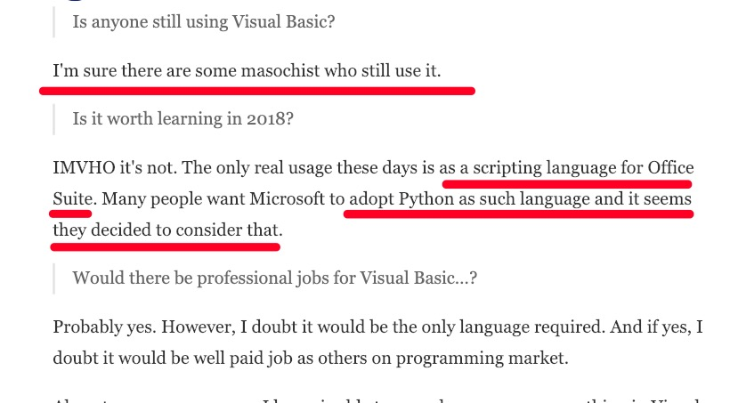

# 11月8日  

首先咕咕了蛮久

## today  
1. 先把域名弄好了，设置了dns，用的**类型A**，**填主机**，*abc.域名.域名*，主机就填*abc*，**指向**填的是服务器ip
2. 知道了vb是远古语言
3. 研究生考试现场确认了，`云考研`成功
4. 阅读并掌握了markdown的语法，了解了其优越性  [献给写作者的 Markdown 新手指南](https://www.jianshu.com/p/q81RER) [为什么作家应该用 Markdown 保存自己的文稿](https://www.jianshu.com/p/qqGjLN)
5. md和azw3，mobi，epub，都是html，html**nb**
6. [写论文用的，latex](https://www.latex-project.org/about/)

## next  

1. 继续看git
2. py
3. [machine learning](https://www.coursera.org/learn/machine-learning)

##  闲谈

1. 今天最大的收获
2. 我要去sc2了

